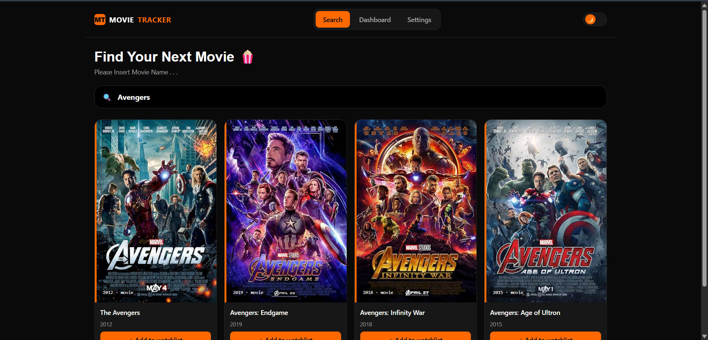
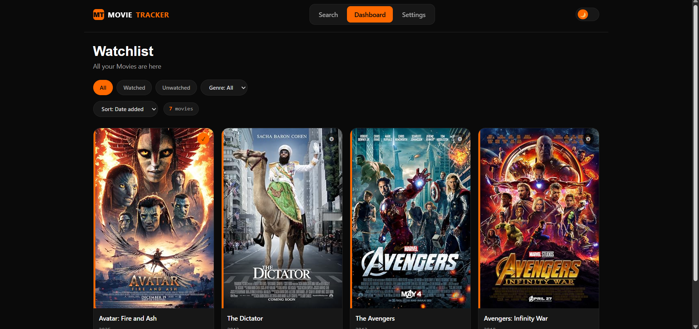
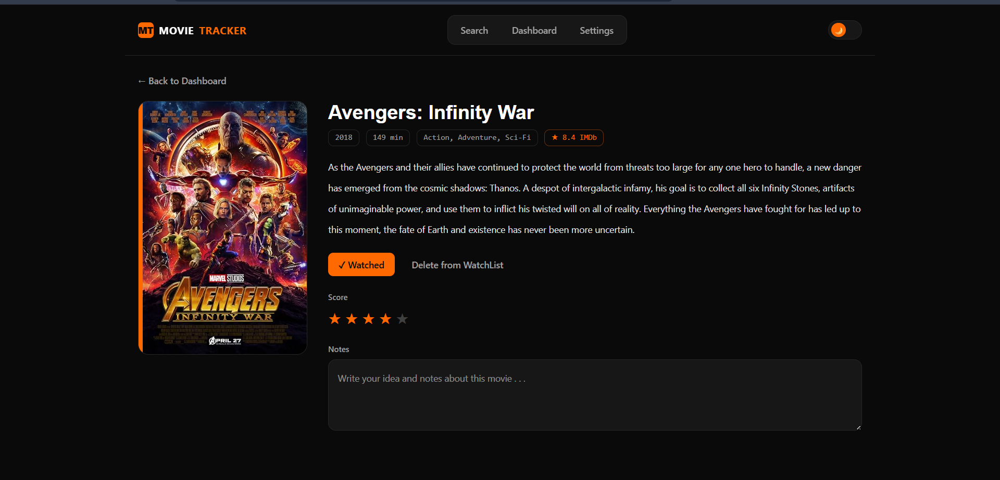
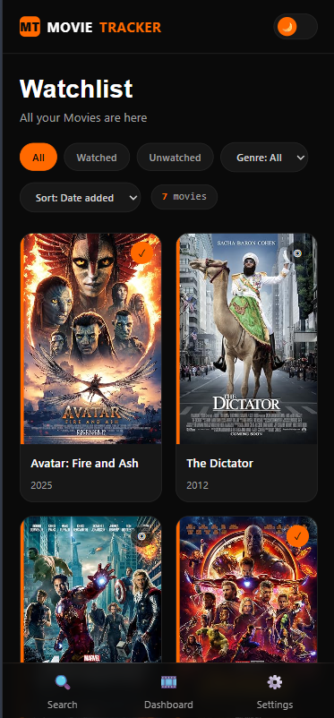

# 🎬 Movie Tracker

A frontend-only movie watchlist app built with **React + Tailwind CSS + React Router**, powered by the [OMDb API](https://www.omdbapi.com/). Search movies, add them to your watchlist, track watched status, rate them, and write notes — all saved locally in your browser.

Built as a portfolio project to practice React Hooks, Context + Reducer, custom hooks, and routing.

## ✨ Features

- 🔍 Search movies (debounced, with skeleton loading)
- 🎞 Dashboard with filters, sorting, and "View more" pagination
- 📄 Movie detail page with rating and auto-saving notes
- 🌗 Dark / light theme (persisted)
- 💾 Everything saved to localStorage

## 📸 Screenshots

  
  
  
  

## 🛠 Tech Stack

React · React Router · Tailwind CSS · Vite · OMDb API

## 🚀 Getting Started

\`\`\`bash
git clone https://github.com/EbrahimVatankhah/movie-tracker.git
cd movie-tracker
npm install
\`\`\`

Create a \`.env\` file in the project root:

\`\`\`
VITE_OMDB_API_KEY=your_api_key_here
\`\`\`

Get a free key at [omdbapi.com/apikey.aspx](https://www.omdbapi.com/apikey.aspx).

\`\`\`bash
npm run dev
\`\`\`

Created with Love and Coffee by Ebrahim 💖 Vatankhah (ebrahim-vatankhah.ir)

## 🌐 Live Demo
[https://EbrahimVatankhah.github.io/movie-tracker/](https://EbrahimVatankhah.github.io/movie-tracker/)

MIT
